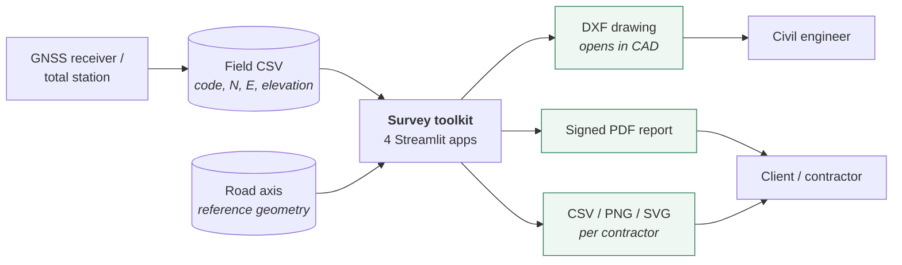
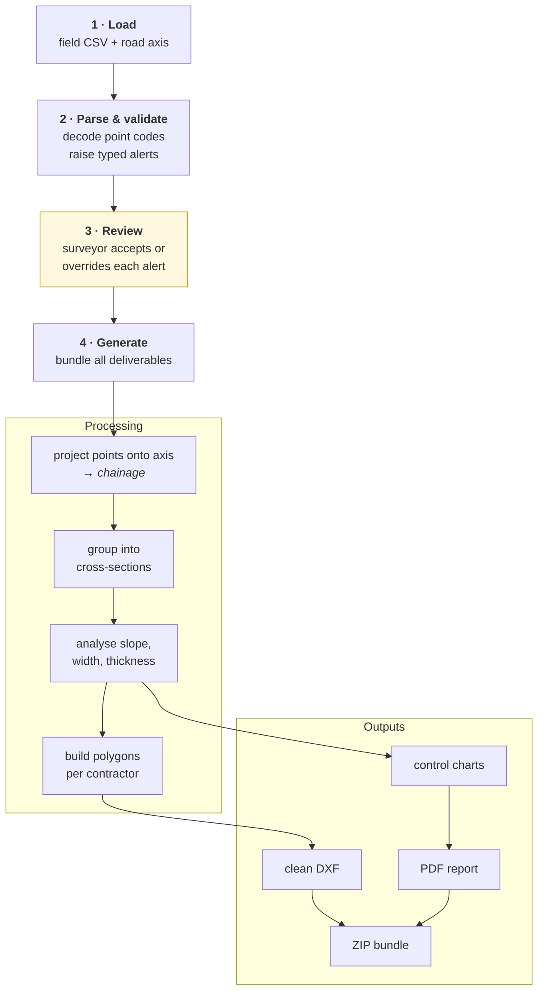
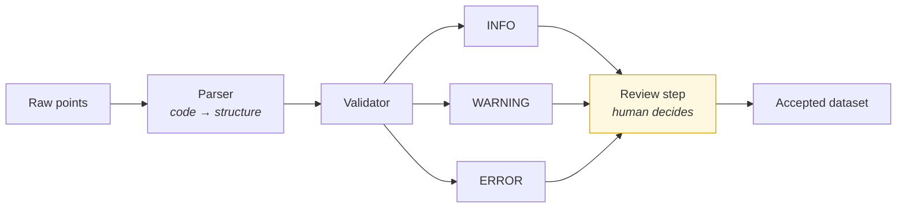
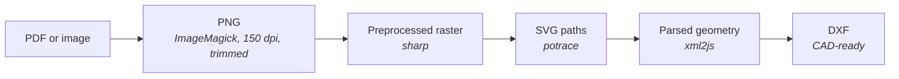
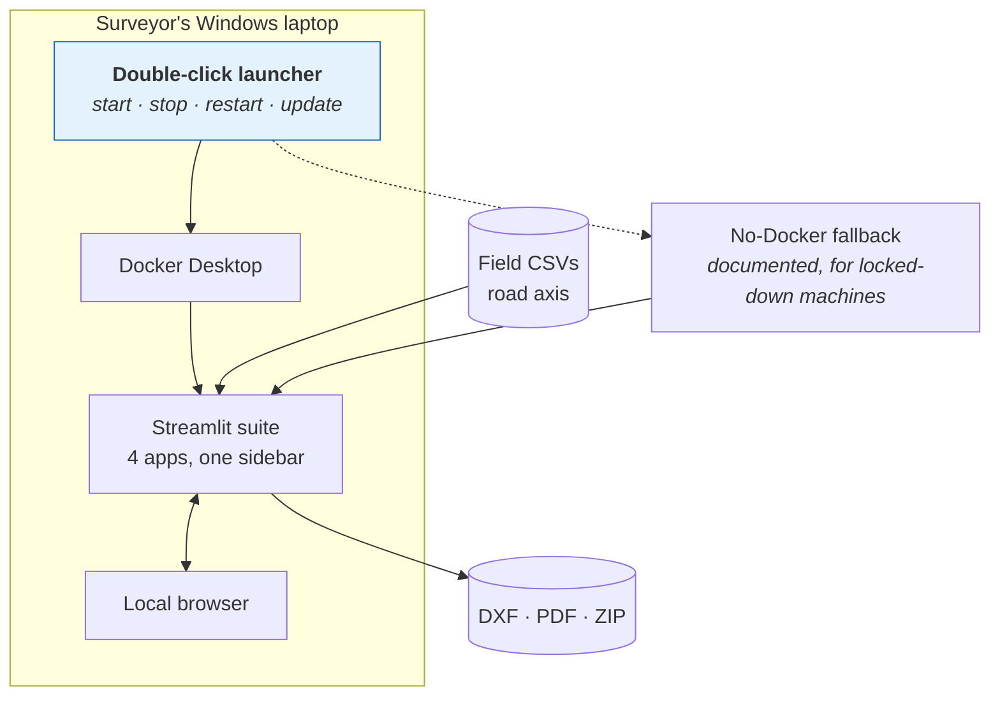

# Architecture

## Contents

- [System context](#system-context)
- [The road-works control pipeline](#the-road-works-control-pipeline)
- [The survey code as a data model](#the-survey-code-as-a-data-model)
- [The validation engine](#the-validation-engine)
- [The raster-to-CAD pipeline](#the-raster-to-cad-pipeline)
- [Delivery topology](#delivery-topology)

---

## System context

Everything starts with instruments and ends with documents. The toolkit is the middle.



The toolkit owns no data of its own. It has no database and no persistent state: a
session takes files in and produces deliverables out. That is a deliberate constraint —
it means a run is reproducible from its inputs, and there is no store to migrate, back
up, or get out of sync with the field.

---

## The road-works control pipeline

Four applications share one suite; this is the largest. It is a guided four-step wizard,
because the users are surveyors doing this occasionally, not operators doing it daily.



Step 3 is highlighted because it is the one that makes the tool trustworthy: nothing is
corrected without a human saying so. See
[ADR-001](decisions/ADR-001-the-tool-advises-the-surveyor-decides.md).

**Processing is separated from presentation.** Geometry and analysis live in one module,
chart and PDF generation in another, and the wizard only orchestrates. The split matters
because the analysis is the part worth testing and the UI is the part that changes every
time somebody sees it.

---

## The survey code as a data model

The codes surveyors already write in the field are the schema. Nothing was invented.

Each code is a short hyphenated string identifying **the contractor**, **the layer**, and
**the position in the cross-section**:

```text
<contractor>-<position>              two-part form, layer defaults to general
<contractor>-<layer>-<position>      three-part form
```

The contractor segment is load-bearing rather than incidental. A road job runs with
several companies working simultaneously on different stretches and layers, and one of the
survey's main purposes is to establish precisely where one company's scope ends and the
next one's begins — so contractor separation propagates all the way through to the polygons
and the delivered drawing.

Parsing accepts both two- and three-part codes, defaulting the middle segment when it is
absent, and returns nothing at all for anything it does not recognise — which becomes an
alert rather than a silent skip. Each parsed point carries contractor, layer, position in
the cross-section, coordinates, elevation, original code, and computed chainage.

Adopting the field convention instead of imposing a new one is why the tool needed no
training. The alternative — a "correct" schema and a mapping table — moves the work onto
the surveyor and gets abandoned.

---

## The validation engine

A dedicated package, roughly 1,230 lines, doing one thing: finding things worth a human
look.

**Three severities**, and the wording of each is the design:

| Severity | Meaning |
|---|---|
| `INFO` | probably fine, shown for completeness |
| `WARNING` | possible problem, worth review |
| `ERROR` | very probably a real error |

Note that even `ERROR` says *very probably*. The engine never claims certainty it does
not have.

**Nine alert types**, covering the failure modes that actually occur in the field:
unrecognised code, contractor in the wrong zone, orphan point, incomplete code, overlap,
chainage jump, duplicate, normalisation applied, and reference issue.

Alerts are typed values — enums and a dataclass, not formatted strings — so the interface
can group, filter and count them, and so a new alert type cannot be introduced without
declaring its severity.



---

## The raster-to-CAD pipeline

A separate Node service turning scanned or PDF plans into editable CAD geometry. Every
stage is an off-the-shelf tool doing what it is best at, wired together explicitly.



Three properties of the design:

**Each stage is its own module.** Conversion, vectorisation and DXF emission are separate
files with separate responsibilities. When a plan fails, the error names the stage.

**Failures are explicit and checked.** Conversion verifies the output file exists rather
than assuming the external command worked — external binaries fail by producing nothing
far more often than by returning an error code.

**Jobs are identified and isolated.** Each upload gets an id and its own file names, so
concurrent jobs cannot collide over a shared temporary path.

Writing a vectoriser instead of calling potrace would have been months of work and worse.
The engineering is in the wiring, the error handling, and knowing which tool to reach for.

---

## Delivery topology

The most-constrained part of the whole system, and the one that decided the stack.



The application runs **on the user's machine**, not on a server. Field data stays with the
firm that owns it, the tool works with no connectivity, and there is no per-seat hosting
cost for four users. See [ADR-005](decisions/ADR-005-docker-as-a-windows-installer.md).
